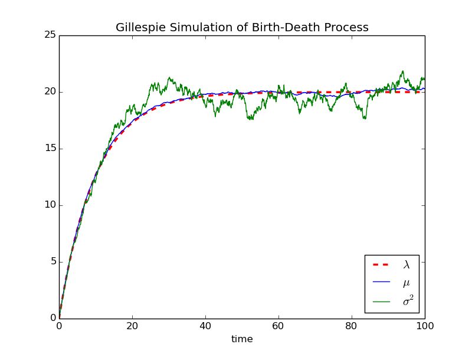
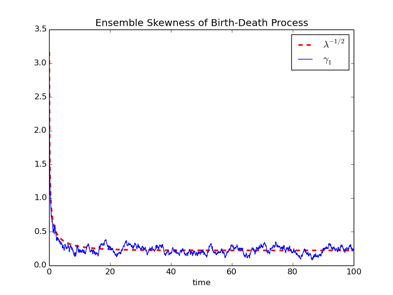
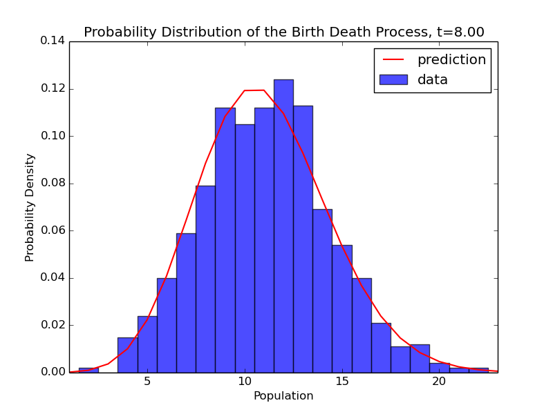
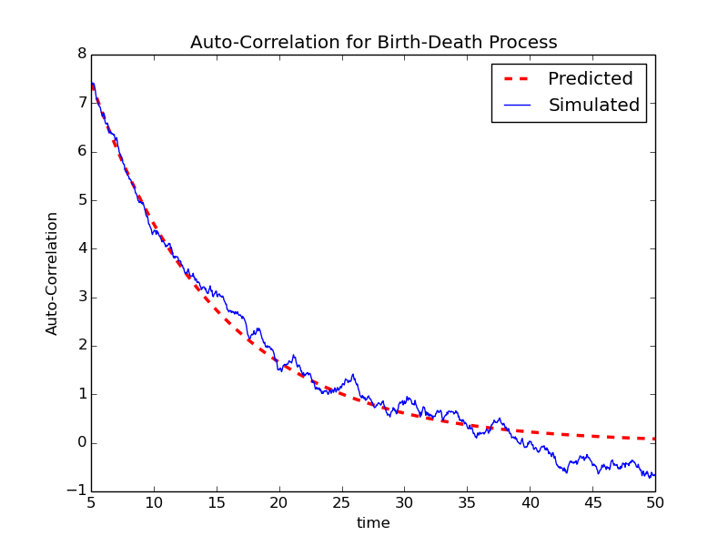

> Julien Varennes
> Stochastic Processes in Physics

# Problem Set 3

## (i) Gillespie Algorithm

- $\vec{x}(t) = \left( x_1(t),...,x_n(t) \right)$ is the state of the system.
- There are $m$ possible reactions $R_\mu$ with $\mu \in \{ 1,...,m \}$.
    - After a reaction $R_\mu$ occurs, $\vec{x}' = \vec{x}+\vec{v}_\mu$.
    - $\vec{v}_\mu = \left( v_{1\mu}, v_{2\mu}, ..., v_{n\mu} \right)$
- The probability that reaction $R_\mu$ occurs between $t$ and $t+dt$ is $a_\mu(\vec{x}) dt$.

1. Initialize at $t = t_0$, $\vec{x} = \vec{x}_0$.
2. Evaluate $\{ a_j(\vec{x})\}$ and $a_0(\vec{x})=\sum_{j=1}^m a_j(\vec{x})$.
3. Draw 2 random numbers from a standard uniform distribution $r_1$, $r_2$.
4. Evaluate $\tau = \frac{1}{a_0(\vec{x})}\ln\left( \frac{1}{r_1} \right)$.
5. Determine $\mu$ such that it's the smallest integer satisfying the following equation: $\sum_{j=1}^\mu a_j(\vec{x})=r_2\cdot a_0(\vec{x})$
6. Determine the new state, $\vec{x} = \vec{x} + \vec{v}_\mu$ and the new time $t = t + \tau$.
7. Stop if $t > t_\text{stop}$.
8. Go back to step 2.

## (ii) Birth-Death Process

In a simple birth-death process there are two possible reactions. Birth: population goes up by one; death: population goes down by one. The state of the system is the population and so $\vec{x}(t) = x(t)$. The change of state vectors are $v_1 = +1, \ v_2 = -1$ and $a_1(x) = k_b, \ a_2(x) = k_dx$. The source code is availible on [my github page](https://github.com/varennes/gillespie-py).

## (iii) Ensemble Values

Since the birth-death process is a Poisson process we know how the ensemble values should behave.

$$
\lambda(t) = \frac{k_b}{k_d}+(x_0-k_b/k_d)e^{-k_dt}
$$

$$
\mu = \lambda, \ \ \ \sigma^2 = \lambda, \\
\gamma_1 = \text{E}\left[ \left(\frac{X-\mu}{\sigma}\right)^3 \right] = \lambda^{-1/2}
$$

The simulation results are in agreement with our theoretical predictions.

## (iv) Probability Distribution

The probability density function for a birth-death process follows a Poisson distribution.

$$
P(x,t) = \frac{e^{-\lambda(t)}[\lambda(t)]^x}{x!}
$$

We can find the distribution computationally by binning all ensemble member values at a specific point in time. The normalized bin values should then be equivalent to the probability distribution.

## (v) Auto-Correlation Function

For a birth-death process, the analytically predicted two-time auto-correlation function has the form

$$ c_{x,x}(t,\tau) = \sigma^2(t)e^{-k_dt}.$$

In the simulations, in order to calculate the auto-correlation function we will use this definition:

$$ c_{x,x}(t,\tau) = < x(t+\tau)x(t) > - <x(t+\tau)><x(t)> .$$

This does not require any major modification of the code since each ensemble trajectory is already stored in the list `xEnsemble`. So all we need to do to calculate $c_{x,x}(t,\tau)$ is to pick the times we are interested in and then average over all ensemble members at those times.

The predicted analytical result agrees very well with the simulations!

## (vi) Time-averaging vs. Ensemble-averaging

I did not need to modify my code since to calculate the time-average of a trajectory since my implementation already stores the time trajectory of each ensemble member. Once the simulation is complete we can pick an ensemble member and calculate the time average. Picking a random trajectory we see that the average population is approximately 20 which is equal to $k_b/k_d$, the ensemble average. As expected, the time-average is equal to the ensemble average.

## (vii) First-Passage Time

We can simulate the first-passage time by choosing some threshold population $\theta$ such that when a trajectory first reaches $x=\theta$ the time is recorded and that instance of the simulation is stopped.

The predicted analytical first-passage time probability density is

$$ \mathcal{P}_{\theta}(\tau) = - \frac{\partial}{\partial\tau} \left[ \sum_{x=0}^{\theta} \frac{e^{-\lambda(t)}[\lambda(t)]^x}{x!} \right]. $$

This is a Gamma distribution of the form $\mathcal{P}_{\theta}(\tau) \sim \tau^a e^{-b\tau}$ with $a \propto 1/\theta$ and $b \propto k_d$.

The simulated probability distribution is in agreement with prediction.
